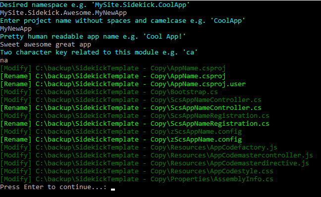

# Generating a new Sidekick App

It's now easier than ever with powershell and the Sidekick template

1. Make sure you have the Sidekick foundation nuget package installed (included in the Sidekick core apps package)
1. Pull down the template zip from [here](https://github.com/JeffDarchuk/SitecoreSidekick/raw/master/doc/SidekickTemplate.zip).
1. Extract it into your Sitecore solution.
1. Navigate to the project in the file system and run the file **RunMeToStart.cmd**
1. 
1. Enter the project namespace
1. Enter the project name camel case and without any spaces or non-word characters
1. Enter a human readable name that users will see when they open sidekick
1. Enter a 2 character code that's unique to your app from the other apps in sidekick
1. The powershell scripts will then rename and inject your properties all over your sidekick app project
1. Open your Sitecore solution and add the project as an existing project
1. Make sure that you're set up to publish your config and binaries to the appropriate location on build

You will now have a new demo app.  here i've named mine "Event Manager"

In this simple app you can click a button to have the angularjs factory call to the backend controller to get some content from the backend and append it to the front end.
Take this idea and expand uppon it to create whatever you want.  Feel like sharing your app?  Turn it into a nuget package with the binaries and configs and people can install it via nuget.
